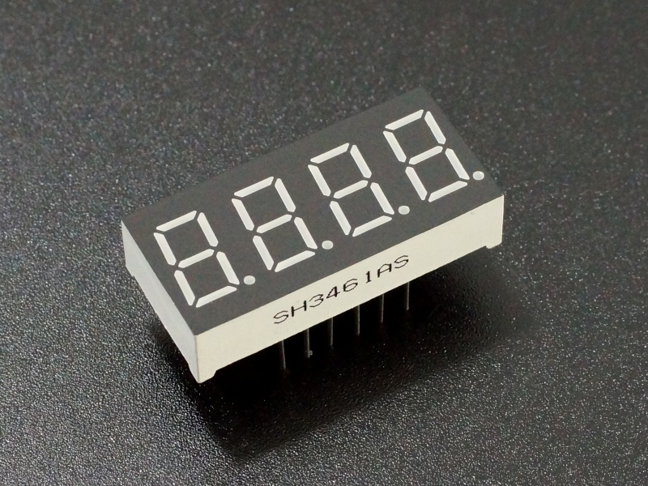

<center>


Created by Ouroboros Embedded Education.
</center>

## Versions Changelog

V1.0.0

- Initial Release

# 7 Segment Display Library

<center></center>

This documentation covers the source files [`disp7.c`](#disp7c), [`disp7.h`](#disp7h), and [`disp7_sweep.h`](#disp7_sweeph) for a modular and flexible 7-segment display driver. This library allows you to control single or multiple 7-segment displays (common anode or cathode) on any microcontroller platform.

---

## Table of Contents

- [7 Segment Display Library](#7-segment-display-library)
  - [Table of Contents](#table-of-contents)
  - [Overview](#overview)
  - [Features](#features)
  - [Architecture](#architecture)
  - [API Reference](#api-reference)
    - [Single Display Control (`disp7.h`/`disp7.c`)](#single-display-control-disp7hdisp7c)
      - [Types and Enums](#types-and-enums)
      - [Structures](#structures)
      - [Functions](#functions)
    - [Multiple Display Sweep Control (`disp7_sweep.h`/`disp7.c`)](#multiple-display-sweep-control-disp7_sweephdisp7c)
      - [Types and Structures](#types-and-structures)
      - [Functions](#functions-1)
  - [Usage Example](#usage-example)
    - [Single Display](#single-display)
    - [Multiple Displays (Multiplexed)](#multiple-displays-multiplexed)
  - [Customization](#customization)
  - [License](#license)

---

## Overview

This library provides an abstraction for controlling 7-segment displays, supporting both single and multi-digit (multiplexed) configurations. It is hardware-independent, requiring only a user-supplied function to set GPIO states.

---

## Features

- Supports both **Common Anode** and **Common Cathode** displays.
- Easy-to-use API for displaying numbers, hexadecimal digits, and raw segment patterns.
- Multiplexing support for multi-digit displays using a "sweep" mechanism.
- Support independent multiple Displays Arrangement.
- User-defined GPIO control for maximum portability.
- Efficient segment mapping for 0-9, A-F.

---

## Architecture

- **disp7.h / disp7.c:**
Core driver for a single 7-segment display.
- **disp7_sweep.h / disp7.c:**
Sweep/multiplexing logic for controlling multiple displays in sequence.

---

## API Reference

### Single Display Control (`disp7.h`/`disp7.c`)

#### Types and Enums

- **`disp7_pins_e`**: Enumerates segment pins (A-G, DP).
- **`disp7_segments_e`**: Bitmasks for each segment and all segments.
- **`disp7_type_e`**: Display type (`DISP7_COMMON_CATHODE`, `DISP7_COMMON_ANODE`).
- **`disp7_state_e`**: Segment state (`DISP_SEG_OFF`, `DISP_SEG_ON`).
- **`Disp7_WriteToPin_fxn`**: Function pointer type for setting a pin state.


#### Structures

```c
typedef struct {
    Disp7_WriteToPin_fxn WriteToPinFxn;
    disp7_type_e eType;
    uint8_t u8Value;
    bool bDecimalPoint;
    bool bInitialized;
    disp7_state_e Segments[^8];
} disp7_t;

typedef struct {
    Disp7_WriteToPin_fxn WriteToPinFxn;
    disp7_type_e eType;
} disp7_params_t;
```


#### Functions

```c
void disp7_init(disp7_t *disp7, disp7_params_t *params);
```

Initialize a display instance.

```c
void disp7_print_number(disp7_t *disp7, uint8_t number, bool Dot);
```

Display a number (0-F), with optional decimal point.

```c
void disp7_print_number_from_char(disp7_t *disp7, char symbol);
```

Display a character ('0'-'9', 'A'-'F', 'a'-'f', '.' or ',').

```c
void disp7_print_raw(disp7_t *disp7, disp7_segments_e raw);
```

Display a raw segment pattern.

---

### Multiple Display Sweep Control (`disp7_sweep.h`/`disp7.c`)

#### Types and Structures

```c
typedef void (*disp7_sweep_ctrl_fnx)(uint8_t TurnOn);

typedef struct {
    disp7_t *psDisplay;
    disp7_sweep_ctrl_fnx fxnControlDisplay;
    struct {
        void *next;
        uint8_t u8Value;
        bool bDot;
    } _intern;
} disp7_alone_t;

typedef struct {
    uint32_t u32RegDisplays;
    disp7_alone_t *psActDisp;
    disp7_alone_t *psFirstDisp;
    bool bInitialized;
} disp7_sweep_t;
```


#### Functions

```c
void disp7Sweep_init(disp7_sweep_t *Disp7Sweep);
```

Initialize the sweep/multiplexing controller.

```c
void disp7Sweep_add_display(disp7_sweep_t *Disp7Sweep, disp7_alone_t *Display);
```

Add a display to the sweep chain.

```c
void disp7Sweep_print_number(disp7_sweep_t *Disp7Sweep, uint32_t Number);
```

Display a multi-digit number across all registered displays.

```c
void Disp7Sweep_set_dot(disp7_sweep_t *Disp7Sweep, uint8_t index, bool DotEn);
```

Enable/disable the decimal point on a specific digit.

```c
void Disp7Sweep_print_string(disp7_sweep_t *Disp7Sweep, char *Str);
```

Display a string (digits and decimal points) across the displays.

```c
void disp7Sweep_timer_interrupt(disp7_sweep_t *Disp7Sweep);
```

Call this function periodically (e.g., in a timer interrupt) to multiplex the displays.

---

## Usage Example

### Single Display

```c
// User-defined function to set a segment pin
void My_WriteToPin(disp7_pins_e pin, uint8_t value) {
    // Set GPIO here
}

disp7_t myDisplay;
disp7_params_t params = {
    .WriteToPinFxn = My_WriteToPin,
    .eType = DISP7_COMMON_CATHODE
};

disp7_init(&amp;myDisplay, &amp;params);
disp7_print_number(&amp;myDisplay, 0xA, false); // Display 'A'
disp7_print_number_from_char(&amp;myDisplay, '3');
disp7_print_raw(&amp;myDisplay, DISP7_SEG_A | DISP7_SEG_D); // Custom segments
```


### Multiple Displays (Multiplexed)

```c
disp7_sweep_t sweep;
disp7_alone_t disp1, disp2, disp3;

disp7Sweep_init(&amp;sweep);
// Initialize each disp7_alone_t and their underlying disp7_t as above
disp7Sweep_add_display(&amp;sweep, &amp;disp1);
disp7Sweep_add_display(&amp;sweep, &amp;disp2);
disp7Sweep_add_display(&amp;sweep, &amp;disp3);

disp7Sweep_print_number(&amp;sweep, 123);
Disp7Sweep_set_dot(&amp;sweep, 1, true); // Enable dot on second digit

// In timer interrupt:
disp7Sweep_timer_interrupt(&amp;sweep);
```


---

## Customization

- **WriteToPinFxn:**
You must implement this function to set the state of each segment pin according to your hardware.
- **Display Type:**
Set `eType` to match your display (common anode/cathode).
- **Sweep Timing:**
Call `disp7Sweep_timer_interrupt()` at a suitable refresh rate (typically 1-2 ms per digit).

---

## License

See repository for license details.

---

**For further details, review the comments and code in the provided source files.**

<div style="text-align: center">⁂</div>

[^1]: disp7.c

[^2]: disp7.h

[^3]: disp7_sweep.h

